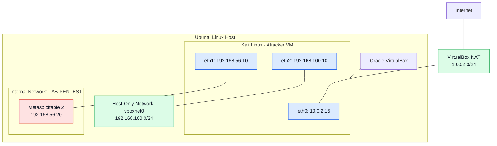

## Network Topology Diagram

The following diagram illustrates the network architecture of the
cybersecurity home lab.

```mermaid
flowchart TB
    INTERNET["Internet"]
    NAT["VirtualBox NAT<br/>10.0.2.0/24"]

    subgraph HOST["Ubuntu Linux Host"]
        VBOX["Oracle VirtualBox"]

        subgraph KALI["Kali Linux - Attacker VM"]
            ETH0["eth0: 10.0.2.15"]
            ETH1["eth1: 192.168.56.10"]
            ETH2["eth2: 192.168.100.10"]
        end

        subgraph PENTEST["Internal Network: LAB-PENTEST"]
            META["Metasploitable 2<br/>192.168.56.20"]
        end

        HOSTONLY["Host-Only Network: vboxnet0<br/>192.168.100.0/24"]
    end

    INTERNET --- NAT
    NAT --- ETH0

    VBOX --- KALI
    ETH1 --- META
    ETH2 --- HOSTONLY

    classDef attacker fill:#dbeafe,stroke:#2563eb,color:#111827
    classDef target fill:#fee2e2,stroke:#dc2626,color:#111827
    classDef network fill:#dcfce7,stroke:#16a34a,color:#111827

    class ETH0,ETH1,ETH2 attacker
    class META target
    class NAT,HOSTONLY network
```
